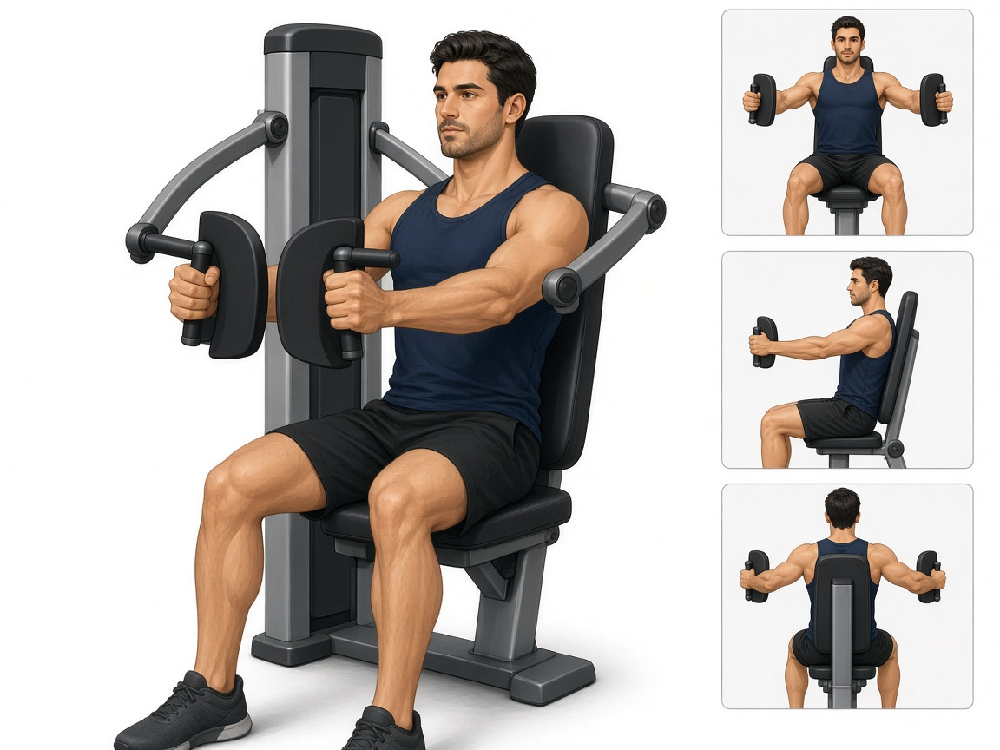

# Бабочка / сведения в тренажёре

**Группа:** грудь (изоляция)  
**Схема:** A  
**Картинка:**

## Как делать
1. Сиденье так, чтобы рукояти были на уровне середины груди.
2. Лопатки слегка сведены, сводить руки перед собой.
3. В конце амплитуды **не** доводить до жёсткого «замка» с рывком.
4. Лёгкий–средний вес, контроль.

## Ошибки
- Рывок корпусом
- Слишком большой вес → работают плечи
- Полное выпрямление/гиперэкстензия в локтях

## Мой макс / рабочий
| Дата | Рабочий на 10–12 | Заметка |
|------|------------------|---------|
| 28.09.2026 | 13 | |
