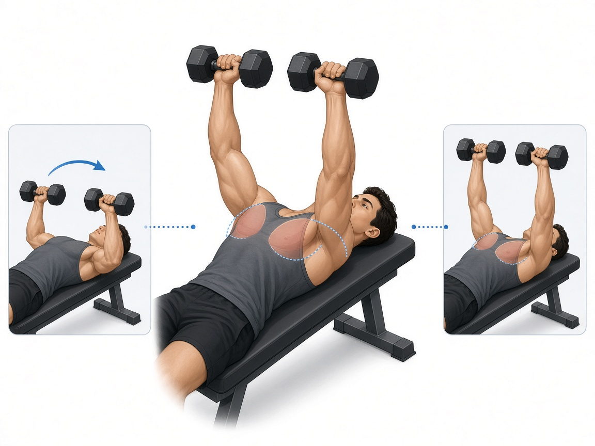

# Жим гантелей лёжа

**Группа:** грудь (база)  
**Схема:** B  
**Картинка:**

## Как делать
1. Та же установка лопаток и стоп, что в жиме штанги.
2. Гантели опускать до комфортной растяжки (не обязательно «ниже скамьи»).
3. Вверху сводить гантели, не стучать ими сильно.
4. Нейтральный или чуть супинированный хват — как удобнее плечам.

## Ошибки
- Слишком глубоко вниз при жёстких плечах
- Прогиб поясницы и отрыв таза
- Разная траектория левой/правой руки

## Мой макс / рабочий
| Дата | Рабочий на 8–10 (каждая) | Заметка |
|------|--------------------------|---------|
| — | 32+32 | оценка: от жима штанги 90 и наклона 28+28 |
