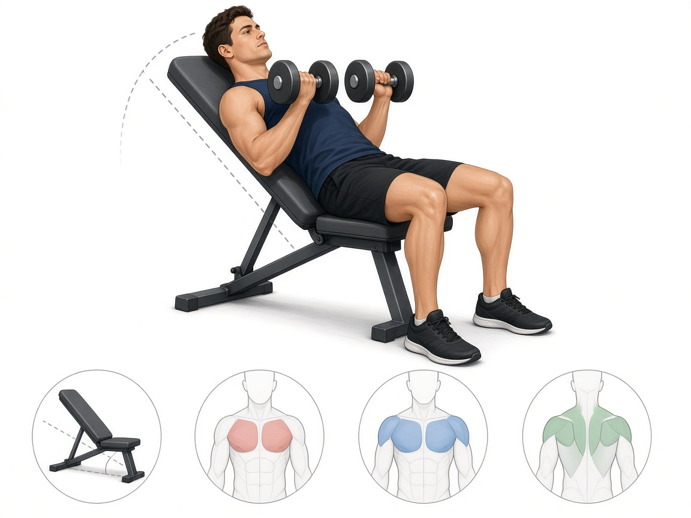

# Жим гантелей на наклонной ~30°

**Группа:** грудь (верх)  
**Схема:** A  
**Картинка:**

## Как делать
1. Скамья **~30°**, не 45° (45° сильно грузит переднюю дельту и шею).
2. Лопатки вместе, опускание контролируемое.
3. Жим чуть к верхней груди / ключицам, без удара гантелей.

## Ошибки
- Угол 45°+ как «верх груди»
- Шея вжимается в скамью, взгляд «в потолок с напряжением»
- Вес такой, что помогают ногами и поясницей

## Мой макс / рабочий
| Дата | Рабочий на 8–10 | Заметка |
|------|-----------------|---------|
| 28.09.2026 | 28+28 | отметил 56 (= сумма) |
