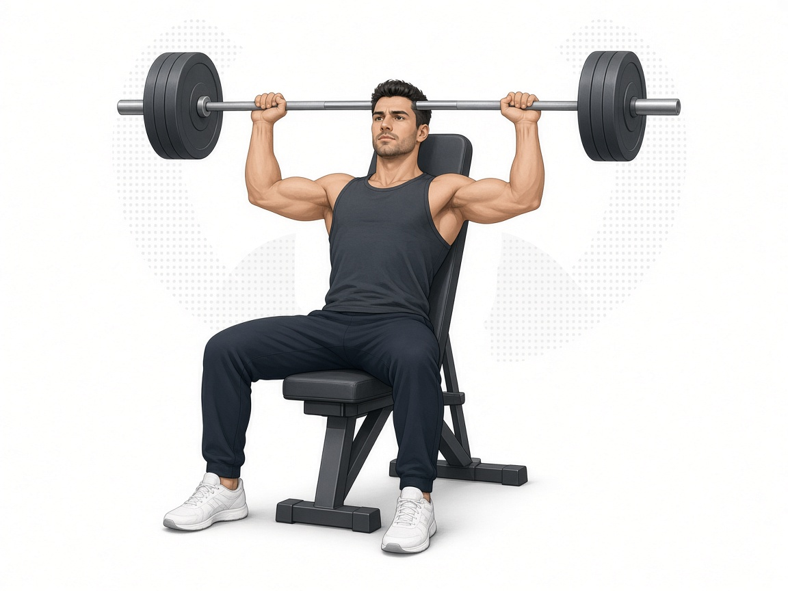

# Жим сидя вверх (верх груди)

**Группа:** грудь (верх) / передняя дельта вторично  
**Схема:** B (показала тренер)  
**Картинка:**

## Как делать
1. Сидя на скамье со спинкой (чуть наклон назад ок), штанга или гриф с тренажёра Смита — как удобно в зале.
2. Жим **вверх** от верхней груди / ключиц — акцент на верх грудных.
3. Не опускать гриф за голову. Локти не уводить далеко назад.
4. Вес умеренный: цель — верх груди, не рекорд в жиме стоя.

## Ошибки
- Жим из-за головы
- Прогиб поясницы «мостиком»
- Слишком тяжёлый вес → работают только плечи и трапеции

## Мой макс / рабочий
| Дата | Рабочий на 8–10 | Заметка |
|------|-----------------|---------|
| — | 50 | оценка: со грифом / Смит, умеренно |
