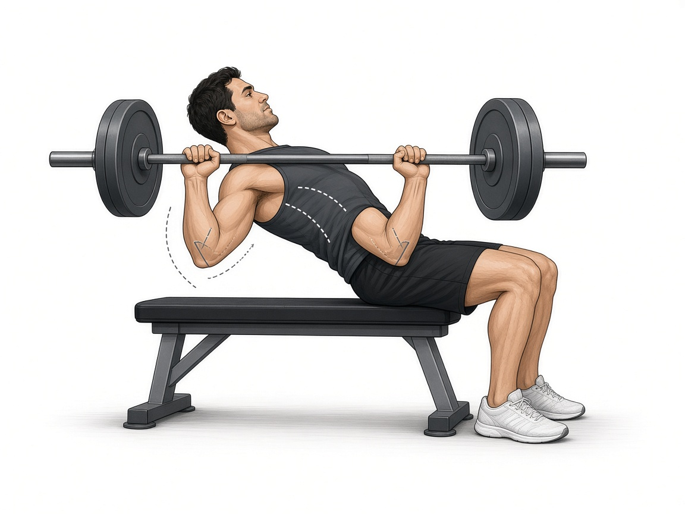

# Жим штанги лёжа

**Группа:** грудь (база)  
**Схема:** A  
**Картинка:**

## Как делать
1. Лопатки сведены и прижаты к скамье, стопы в пол.
2. Хват чуть шире плеч, гриф опускать на **нижнюю часть груди**.
3. Локти ~45° к корпусу, не 90° в стороны.
4. Без отбива от груди; вверху не прогибать поясницу лишним мостом.

## Ошибки
- Отбив грифа от груди
- Локти «в стороны» → нагрузка на плечо
- Ягодицы отрываются от скамьи
- Слишком широкий/узкий хват «на силу» без контроля

## Мой макс / рабочий
| Дата | Рабочий на 8–10 | Заметка |
|------|-----------------|---------|
| 28.09.2026 | 90 | со грифом |
