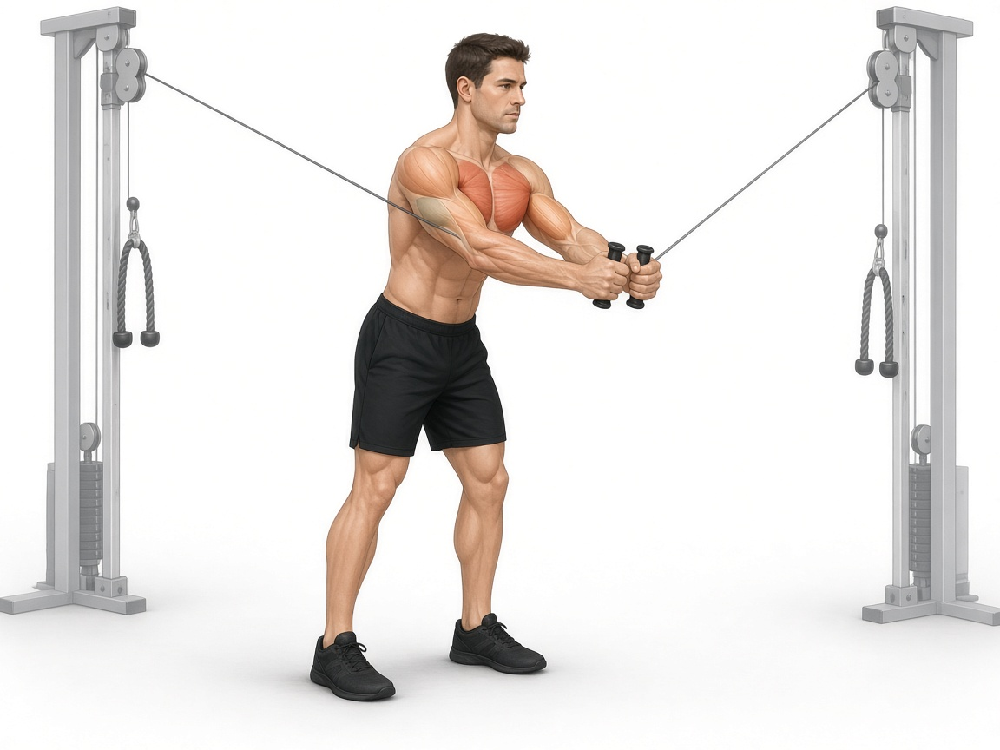

# Кроссовер (две верёвки / рукояти)

**Группа:** грудь (изоляция)  
**Схема:** B (показала тренер)  
**Картинка:**

## Как делать
1. Два верхних блока (или канаты/верёвки — как в зале), шаг вперёд, лёгкий наклон корпуса.
2. Сводить руки перед собой дугой; можно менять угол: сверху вниз (низ груди) или снизу вверх (верх).
3. Локти мягкие, движение грудью, не «тяги» бицепсом.
4. В пике — короткая пауза 1 сек.

## Ошибки
- Раскачка корпусом и шаги назад-вперёд каждый повтор
- Прямые локти насквозь
- Слишком тяжёлый стек → трапеции и плечи забирают работу

## Варианты в один фокус-день
- Верёвки **сверху** → низ/середина груди  
- Рукояти **снизу** → верх груди  

## Мой макс / рабочий
| Дата | Угол | Рабочий на 12–15 | Заметка |
|------|------|------------------|---------|
| — | сверху вниз | 12 | оценка: на сторону ≈ бабочка 13 |
