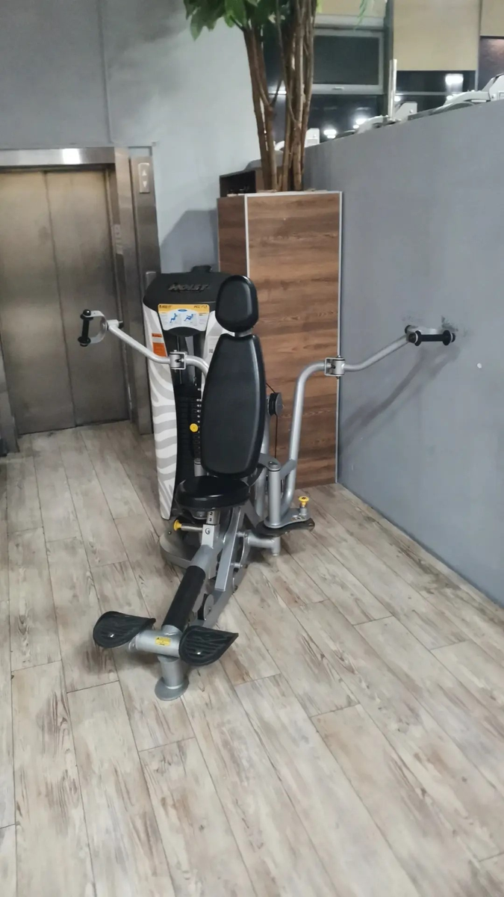

# Разводка лёжа с гантелями

**Группа:** грудь (изоляция)  
**Схема:** A и B  
**Картинка:**

## Как делать
1. Лёжа на горизонтальной скамье, гантели над грудью, локти чуть мягкие.
2. Разводи руки в стороны-вниз до комфортной растяжки груди (не до боли в плечах).
3. Своди гантели снизу вверх по дуге, вверху не стучи гантелями.
4. Темп спокойный, вес меньше, чем в жиме — это изоляция.

## Ошибки
- Слишком глубоко вниз при жёстких плечах
- Выпрямление локтей «в замок»
- Превращение разводки в жим (локти уходят под гантели)

## Мой макс / рабочий
| Дата | Рабочий на 10–12 (каждая) | Заметка |
|------|---------------------------|---------|
| — | 14+14 | оценка |
