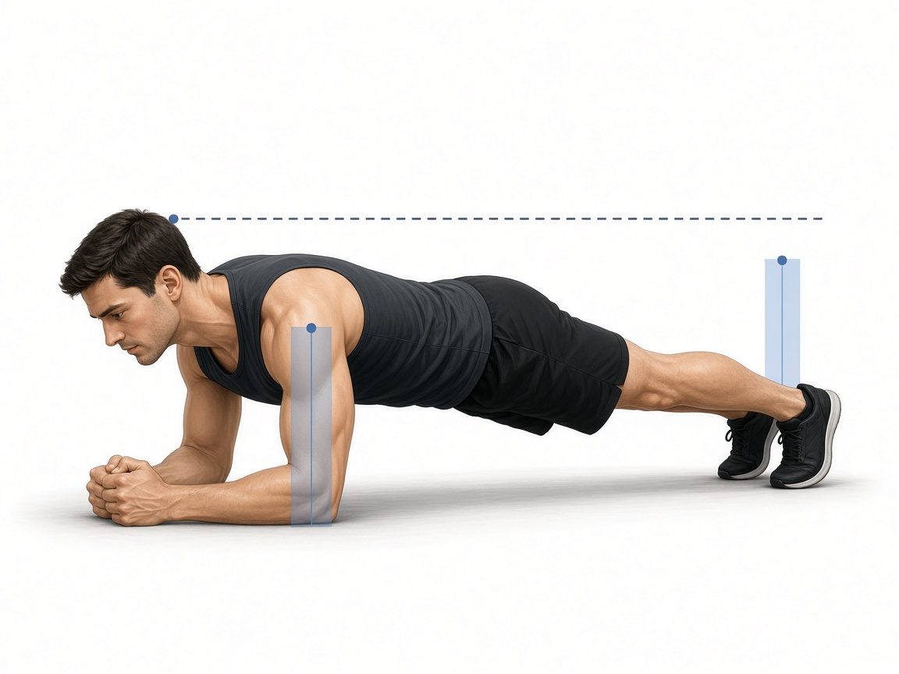

# Планка

**Группа:** корпус  
**Схема:** A и B (день ног, чередуется с прессом)  
**Картинка:**

## Как делать
1. Упор на предплечья и носки, локти под плечами.
2. Корпус прямой: таз не провисает и не торчит вверх.
3. 3×30–45 сек, дыхание ровное, взгляд в пол чуть впереди рук.

## Ошибки
- Провал поясницы
- Подъём таза «домиком»
- Задержка дыхания до тряски

## Мой макс / рабочий
| Дата | Вариант | Результат | Заметка |
|------|---------|-----------|---------|
| — | планка | 40 сек × 3 | пиши секунды на подход в приложении |
