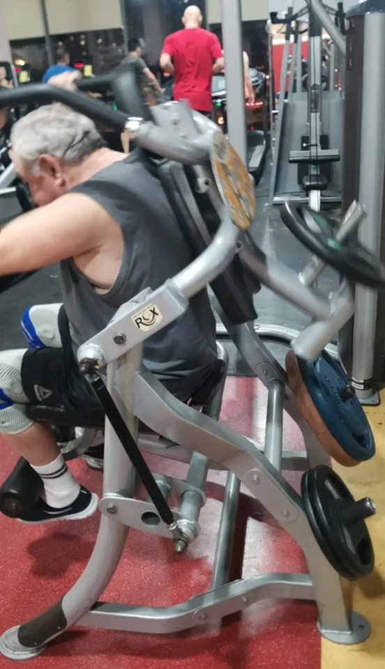

# Пресс в тренажёре

**Группа:** корпус  
**Схема:** B (день ног; чередуется с планкой)  
**Картинка:**

## Как делать
1. Сядь устойчиво, стопы на платформе / под упором по инструкции тренажёра.
2. Возьмись за рукояти, прижми поясницу; корпус и сиденье уходят вперёд за счёт пресса, не тяни шею.
3. Вверху короткая пауза, назад медленно без броска веса.
4. 3×12–15, вес средний — контроль важнее килограммов.

## Ошибки
- Рывок головой и руками
- Отрыв таза и работа ногами
- Слишком большой вес → раскачка корпусом

## Мой макс / рабочий
| Дата | Вариант | Результат | Заметка |
|------|---------|-----------|---------|
| 28.09.2026 | тренажёр | 45 | 3×12–15 |
