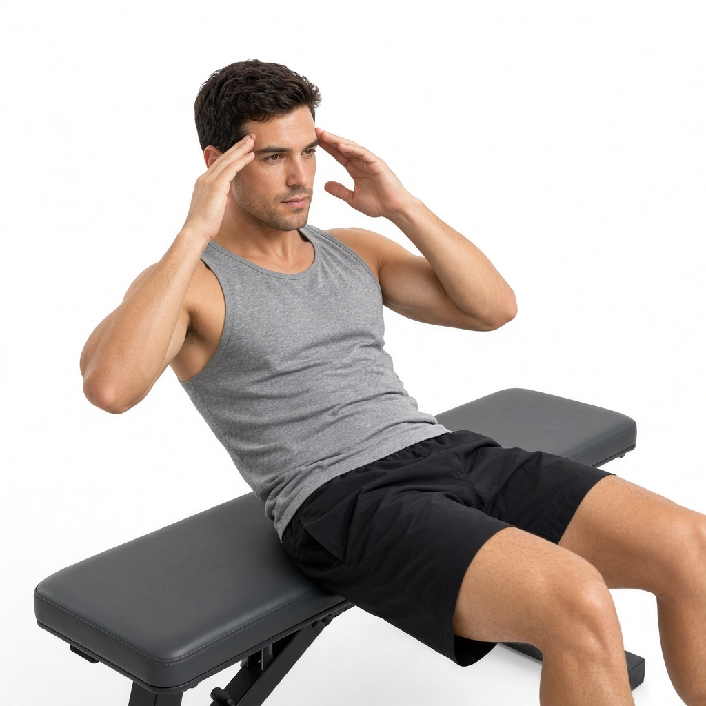

# Скручивания

**Группа:** корпус  
**Схема:** A (день ног)  
**Картинка:**

## Как делать
1. На скамье или полу: колени согнуты, поясница прижата.
2. Пальцы у висков или руки на груди — **не** тяни шею руками.
3. Поднимай лопатки за счёт пресса, вверху короткая пауза, вниз с контролем.
4. 3×12–15 до сильного жжения, без рывка. В приложении пиши **кол-во раз** на подход.

## Ошибки
- Тяга головой руками за шею
- Полный подъём корпуса как «скручивание-ситап» с рывком
- Отрыв поясницы и работа бёдрами вместо пресса

## Мой макс / рабочий
| Дата | Вариант | Результат | Заметка |
|------|---------|-----------|---------|
| — | скручивания | 12–15 раз × 3 | свой вес; пиши повторы в приложении |
