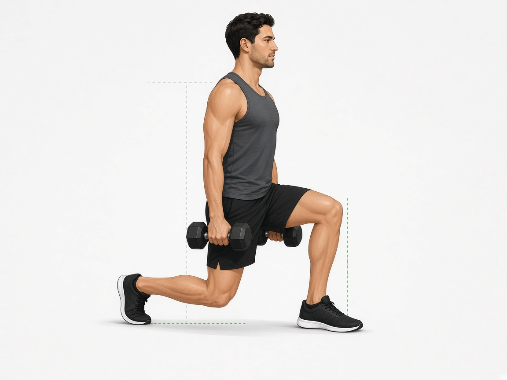

# Выпады с гантелями в ходьбе

**Группа:** ноги (почти вся нога: квадрицепс, ягодицы, стабилизаторы)  
**Схема:** B (показала тренер)  
**Картинка:**

## Как делать
1. Гантели в руках по бокам, корпус прямой.
2. Шаг **вперёд** одной ногой, заднее колено мягко к полу (не ударять).
3. Переднее колено над стопой / чуть вперёд, но не заваливать внутрь.
4. Встать через переднюю пятку, шаг другой ногой — «прогулка».
5. 10–12 шагов на каждую ногу = 1 подход. Коридор зала / дорожка.

## Ошибки
- Короткий шаг → колено сильно уезжает вперёд и болит
- Удар задним коленом об пол
- Наклон корпуса вперёд с круглым верхом спины
- Слишком тяжёлые гантели с первого раза (начни легче приседа)

## Мой макс / рабочий
| Дата | Гантели (каждая) | Шаги на ногу | Заметка |
|------|------------------|--------------|---------|
| — | 14+14 | 10–12 | оценка: легче приседа 110 |
