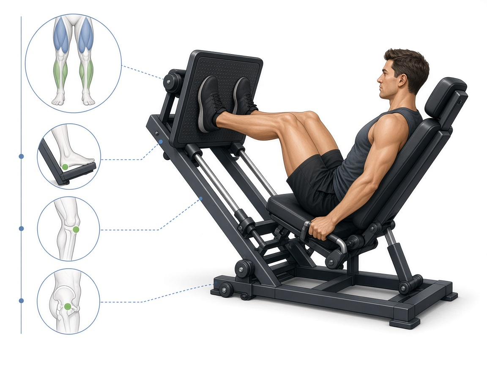

# Жим ногами

**Группа:** ноги (квадрицепс)  
**Схема:** A / чередование  
**Картинка:**

## Как делать
1. Стопы **выше и чуть шире** на платформе — мягче для коленей.
2. Таз прижат, колени не выпрямлять в щелчок.
3. Контроль вниз, без отскока.

## Ошибки
- Отрыв таза в нижней точке
- «Замок» коленей с ударом
- Стопы слишком низко → удар по коленям

## Мой макс / рабочий
| Дата | Рабочий на 10–12 | Заметка |
|------|------------------|---------|
| 28.09.2026 | 85+85 | на сторону |
