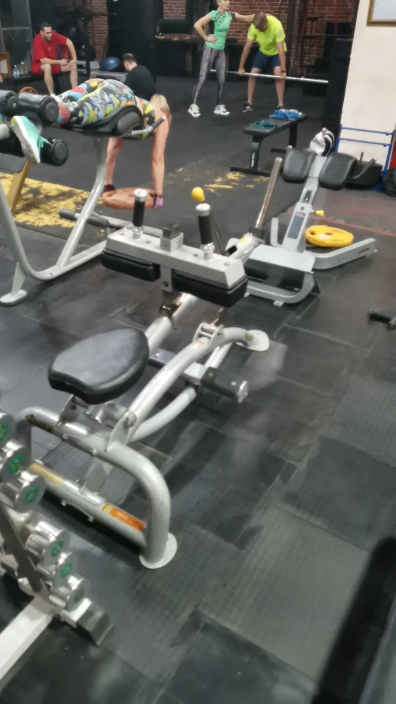

# Подъём на носки сидя

**Группа:** икры  
**Схема:** B  
**Картинка:**

## Как делать
1. Сядь, подушечки стоп на платформе, валики на бёдрах над коленями.
2. Подними носки вверх до полного сокращения, пауза 1 сек.
3. Опусти вниз на полную амплитуду, не пружинь.
4. 3×12–15.

## Ошибки
- Только пол-амплитуды
- Отскок из нижней точки
- Огромный вес с читингом корпусом

## Мой макс / рабочий
| Дата | Рабочий на 12–15 | Заметка |
|------|------------------|---------|
| 28.09.2026 | 75+75 | на сторону |
