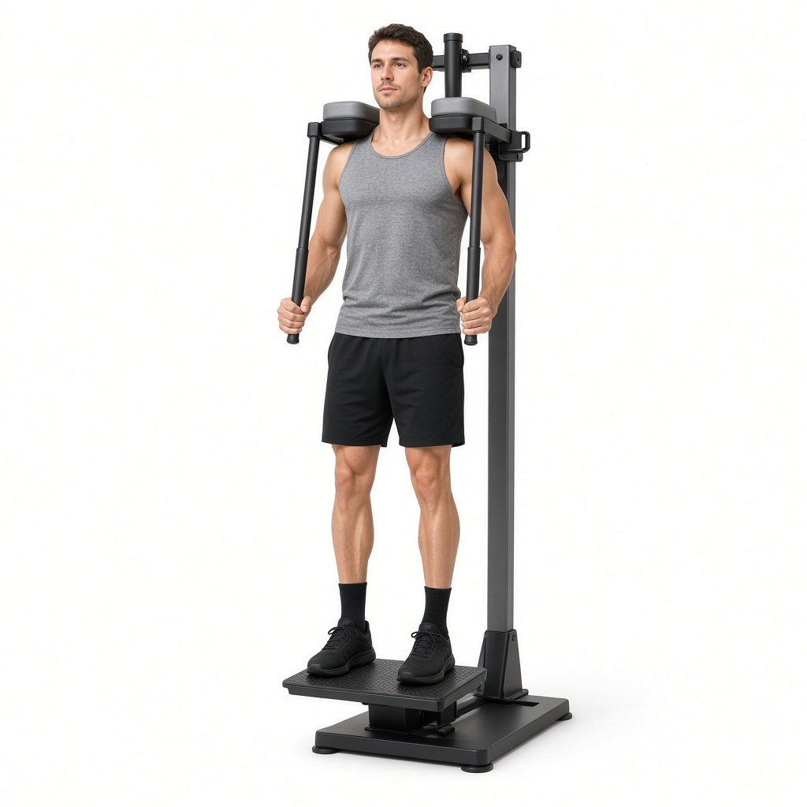

# Подъём на носки стоя

**Группа:** икры  
**Схема:** A  
**Картинка:**

## Как делать
1. Носки на платформе, пятки свободно свисают, корпус прямой.
2. Поднимись на носки до полного сокращения икры, пауза 1 сек вверху.
3. Опусти пятки вниз с контролем на полную амплитуду.
4. 3×12–15, без пружины и раскачки корпусом.

## Ошибки
- Только пол-амплитуды
- Отскок из нижней точки
- Сгибание коленей и читинг корпусом

## Мой макс / рабочий
| Дата | Рабочий на 12–15 | Заметка |
|------|------------------|---------|
| — | 40+40 | оценка |
