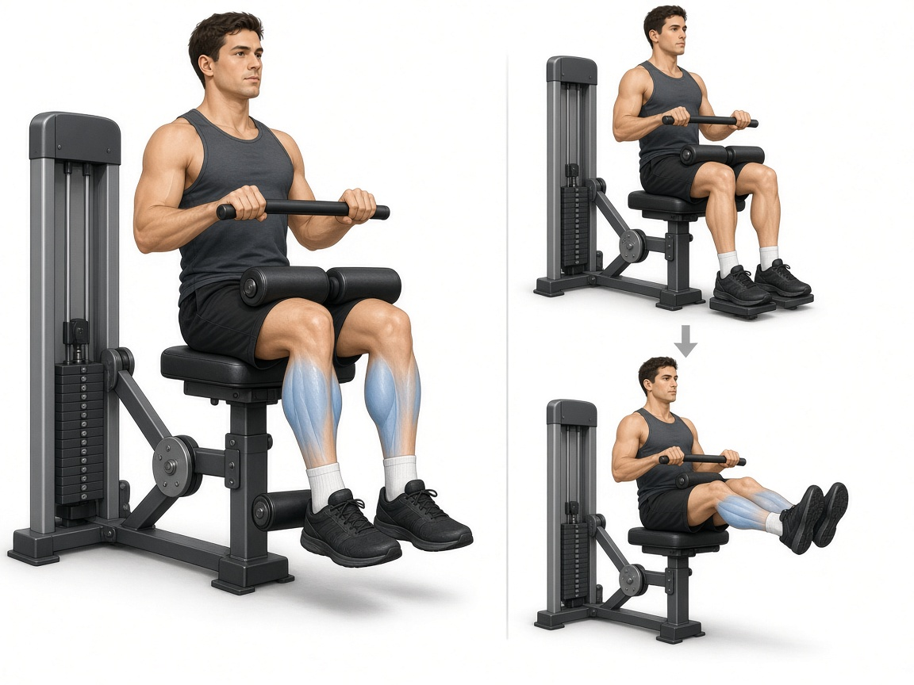

# Подъём на носки сидя

**Группа:** икры  
**Схема:** A и B  
**Картинка:**

## Как делать
1. Полная амплитуда вниз–вверх.
2. Пауза 1 сек вверху, не пружинить.
3. 12–15 повторов.

## Ошибки
- Только пол-амплитуды
- Отскок из нижней точки
- Огромный вес с читингом корпусом

## Мой макс / рабочий
| Дата | Рабочий на 12–15 | Заметка |
|------|------------------|---------|
| 28.09.2026 | 75+75 | на сторону |
