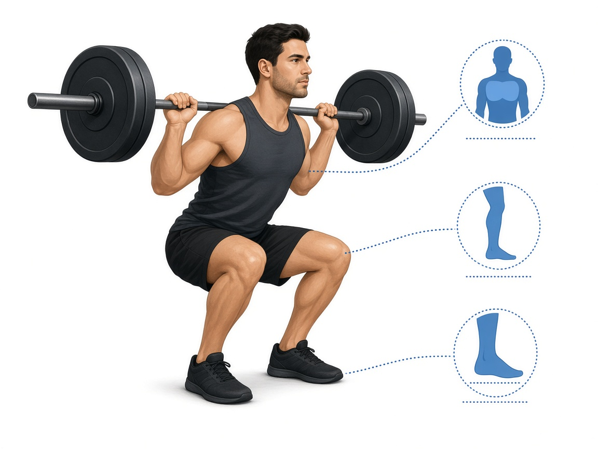

# Присед

**Группа:** ноги (квадрицепс, ягодицы)  
**Схема:** A  
**Картинка:**

## Как делать
1. Штанга / goblet / тренажёр со спинкой — что стабильнее для коленей и поясницы.
2. Колени по носкам, пятки в пол.
3. Глубина — пока поясница не круглится. При боли в коленях — box-squat на ящик.

## Ошибки
- Колени внутрь
- Пятки отрываются
- Гнать вес ценой круглой поясницы
- Совмещать тяжёлый присед и тяжёлый жим ногами «в отказ» в один день без задней цепи

## Мой макс / рабочий
| Дата | Вариант | Рабочий на 8–10 | Заметка |
|------|---------|-----------------|---------|
| 28.09.2026 | штанга | 110 | со грифом |
