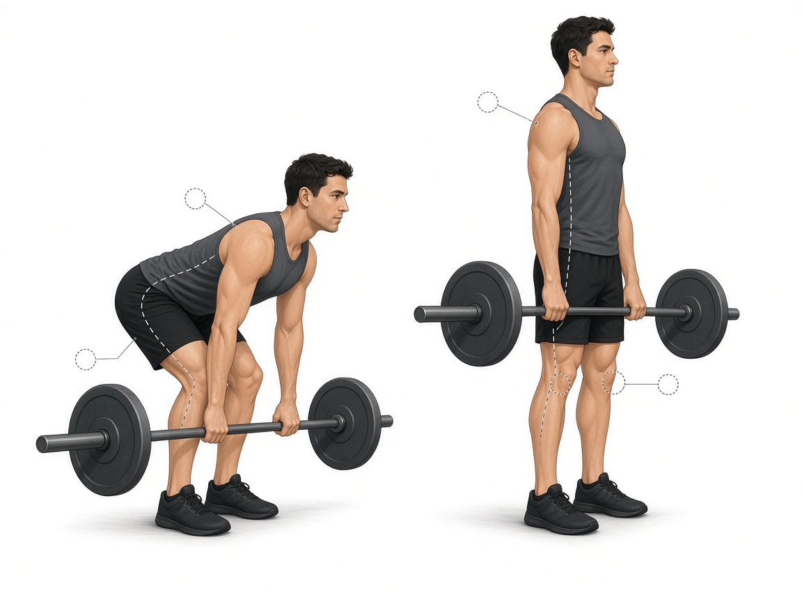

# Румынская тяга

**Группа:** ноги (задняя поверхность бедра, ягодицы)  
**Схема:** A и B  
**Картинка:**

## Как делать
1. Ноги чуть мягкие, гриф/гантели скользят вдоль бёдер.
2. Таз назад, спина прямая. Чувство в бицепсе бедра, не в пояснице.
3. Не ниже, чем позволяет прямая спина.

## Ошибки
- Круглая поясница
- Сильное сгибание коленей «в присед»
- Рывок вверх спиной

## Мой макс / рабочий
| Дата | Снаряд | Рабочий на 8–10 | Заметка |
|------|--------|-----------------|---------|
| 28.09.2026 | штанга / гантели | 40 | сумма / со грифом |
