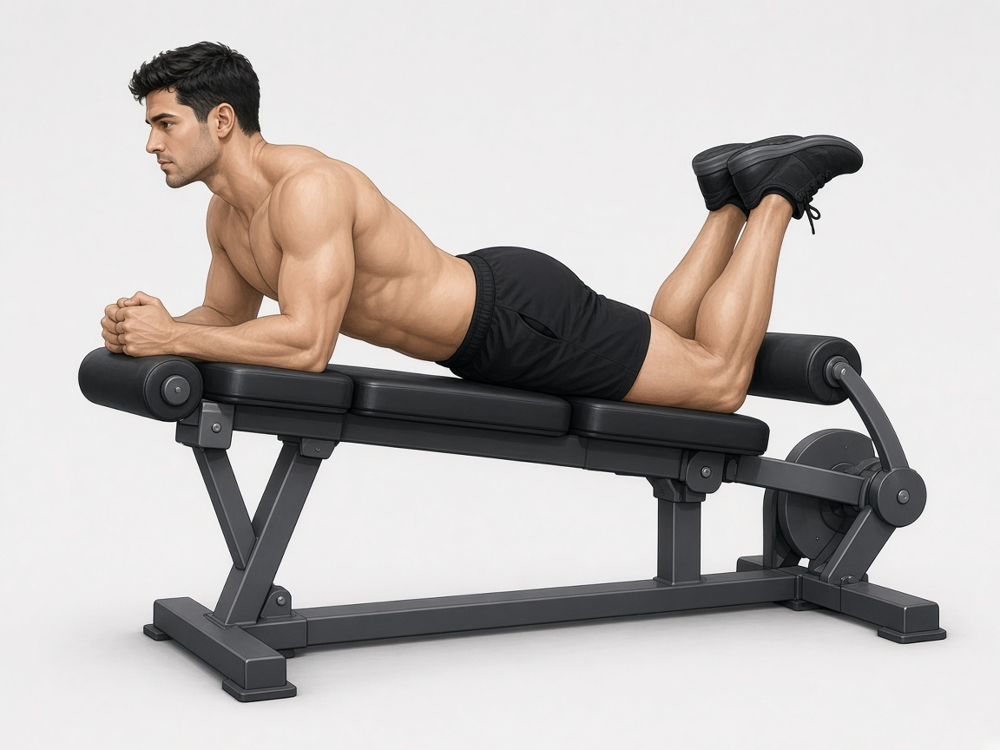

# Сгибание ног (лёжа или сидя)

**Группа:** ноги (бицепс бедра, изоляция)  
**Схема:** A и B  
**Картинка:**

## Как делать
1. Таз прижат, сгибание без отрыва бёдер.
2. Вверху короткая пауза, вниз медленно.
3. Без осевой нагрузки на позвоночник — добивка после румынки.

## Ошибки
- Рывок тазом
- Слишком большой вес с раскачкой
- Полный «бросок» вниз

## Мой макс / рабочий
| Дата | Тренажёр | Рабочий на 10–12 | Заметка |
|------|----------|------------------|---------|
| 28.09.2026 | лёжа / сидя | 68+68 | на сторону |
