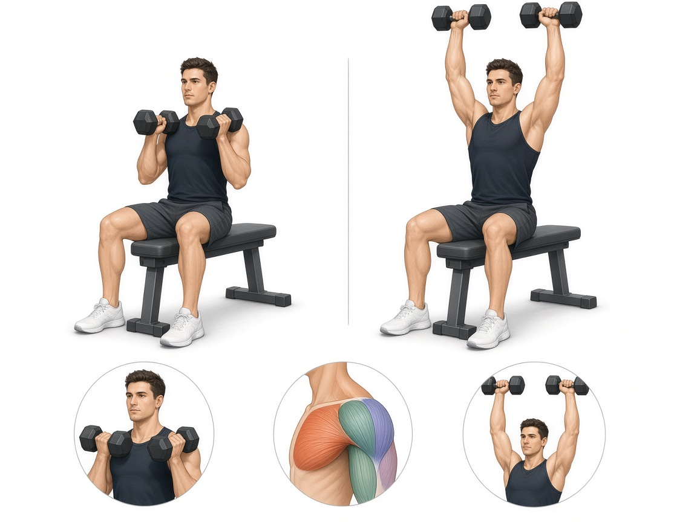

# Жим Арнольда

**Группа:** плечи (передний + средний пучок)  
**Схема:** B (показала тренер)  
**Картинка:**

## Как делать
1. Сидя, гантели перед собой на уровне плеч, ладони к себе.
2. Жим вверх с **ротацией**: вверху ладони смотрят вперёд.
3. Обратным путём вниз с контролем.
4. Вес меньше, чем в обычном жиме гантелей — здесь важна траектория.

## Ошибки
- Рывок и читинг спиной
- Слишком тяжёлые гантели без ротации «как обычный жим»
- Прогиб поясницы

## Мой макс / рабочий
| Дата | Рабочий на 8–10 (каждая) | Заметка |
|------|--------------------------|---------|
| — | 14+14 | оценка: ниже рычага 25, важна ротация |
