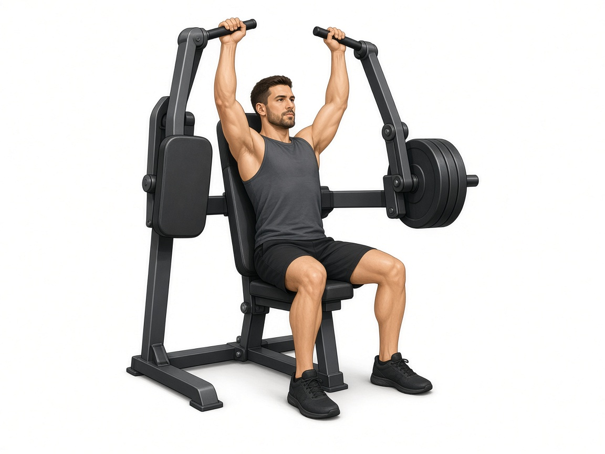

# Жим от плеч в рычажном тренажёре

**Группа:** плечи  
**Схема:** A  
**Картинка:**

## Как делать
1. Спина прижата, не прогибать поясницу.
2. Не опускать ручки за уши / за голову.
3. Жим вверх до почти выпрямления, без удара в суставе.

## Ошибки
- Мост поясницей
- Опускание за голову
- Слишком тяжёлый вес → шея и трапеции

## Мой макс / рабочий
| Дата | Рабочий на 8–10 | Заметка |
|------|-----------------|---------|
| 28.09.2026 | 25 | |
