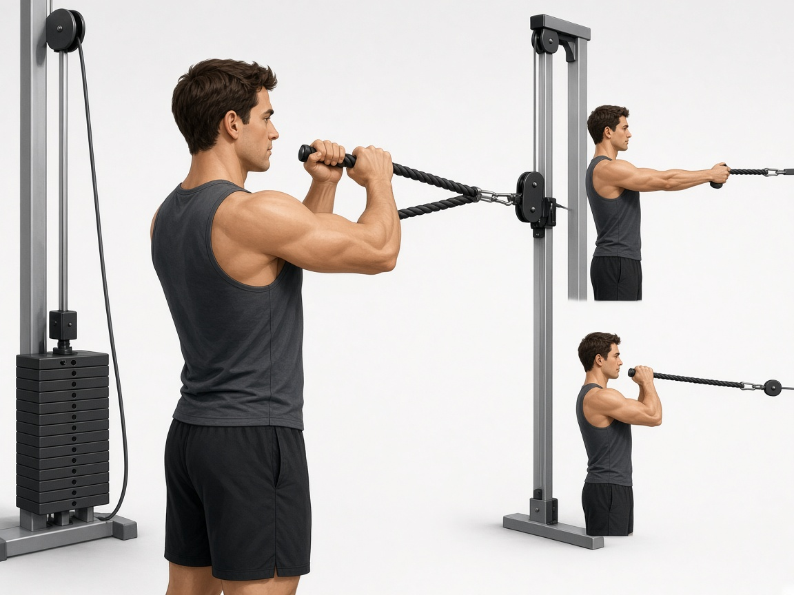

# Задняя дельта / тяга каната к лицу (face pull)

**Группа:** плечи (задний пучок) — страховка для жимов  
**Схема:** A и B  
**Картинка:**

## Как делать
1. Тренажёр «обратные разведения» или блок с канатом к лицу.
2. Лёгкий вес, локти наружу, сведение лопаток.
3. 12–15 повторов, контроль.

## Ошибки
- Слишком тяжёлый вес → низ спины и трапеции
- Тяга к животу вместо лица/ключин
- Пропуск этого упражнения неделями

## Мой макс / рабочий
| Дата | Вариант | Рабочий на 12–15 | Заметка |
|------|---------|------------------|---------|
| 28.09.2026 | разведения / face pull | 10 | |
