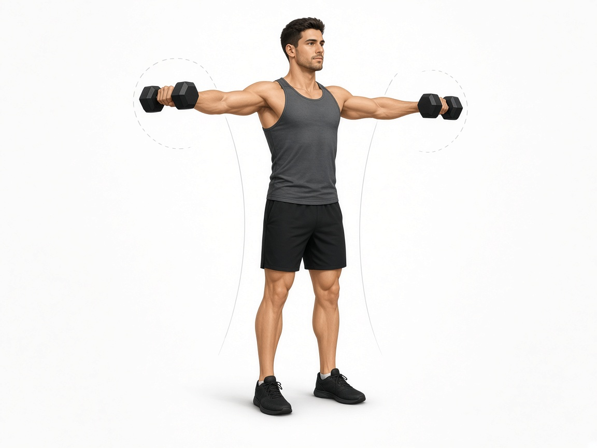

# Разведения гантелей в стороны

**Группа:** плечи (средний пучок, изоляция)  
**Схема:** A и B  
**Картинка:**

## Как делать
1. Локоть чуть мягкий, подъём не выше плеча.
2. Вес маленький, корпус стабильный.
3. Можно чуть наклонить гантели «как лейку» — мизинец чуть выше.

## Ошибки
- Раскачка и тяжёлые гантели → трапеция + риск импиджмента
- Выше плеч с болью
- Полностью прямые локти

## Мой макс / рабочий
| Дата | Рабочий на 12–15 | Заметка |
|------|------------------|---------|
| 28.09.2026 | 10+10 | отметил 20 (= сумма) |
