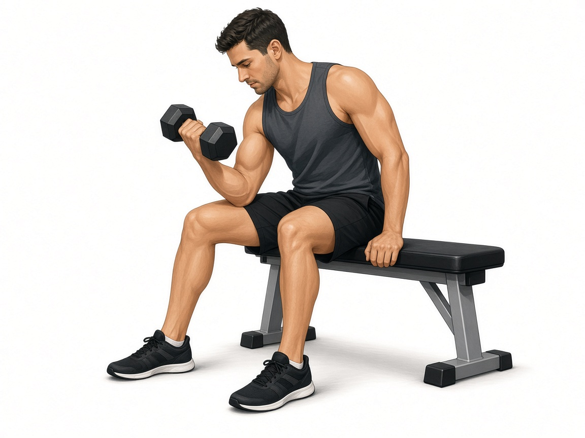

# Бицепс сидя одной рукой

**Группа:** бицепс  
**Схема:** B (показала тренер)  
**Картинка:**

## Как делать
1. Сидя, локоть зафиксирован (можно упереть во внутреннюю поверхность бедра — «концентрированное» сгибание — или держать корпус стабильно с гантелью).
2. Одна рука: полный подъём с супинацией, медленный спуск.
3. Без раскачки, вес меньше, чем стоя со штангой.

## Ошибки
- Помощь корпусом и плечом
- Рывок вверху
- Слишком тяжёлая гантель → меньше амплитуда

## Мой макс / рабочий
| Дата | Гантель | Повторы на руку | Заметка |
|------|---------|-----------------|---------|
| — | 14 | 8–10 | оценка: легче молотков 19+19 |
