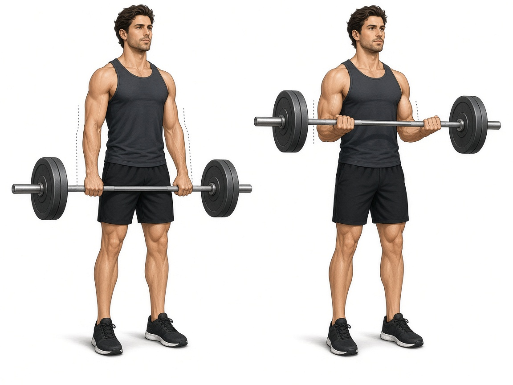

# Подъём штанги на бицепс + добивка частями

**Группа:** бицепс  
**Схема:** A (техника от тренера)  
**Картинка:**

## Как делать — база
1. Локти прижаты, подъём без читинга корпусом.
2. 3×8–10 полных повторов рабочим весом.

## Добивка (после рабочих подходов)
Тот же гриф, вес **чуть легче** или тот же, если свежий:

1. **Снизу до пояса** — много коротких повторов (частичная амплитуда).
2. **От пояса к груди** — много коротких повторов верхней части.
3. **Полный ход** от ног до груди — до сильного жжения, запас 1–2 повтора.

Не превращай добивку в отказ до дрожи в локтях каждый раз.

## Ошибки
- Читинг спиной на тяжёлом весе
- Локти уезжают вперёд
- Добивка max-весом «на силу»

## Мой макс / рабочий
| Дата | Рабочий полный ход | Добивка (вес) | Заметка |
|------|--------------------|---------------|---------|
| 28.09.2026 | 22 | — | со грифом |
