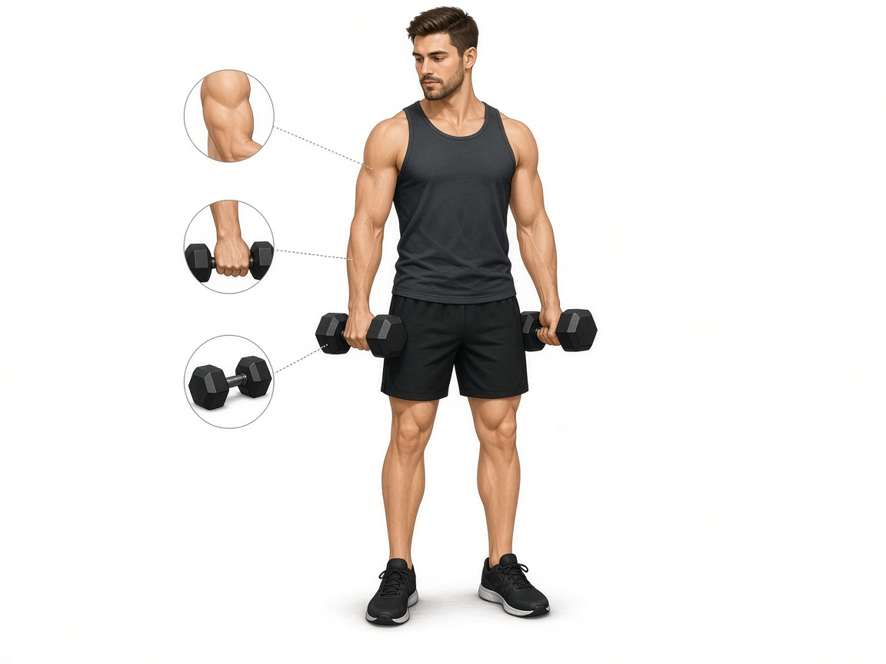

# Молотковые сгибания

**Группа:** бицепс / брахиалис  
**Схема:** A и B  
**Картинка:**

## Как делать
1. Гантели нейтральным хватом (ладони друг к другу).
2. Локти прижаты, без супинации вверху.
3. Мягче для локтя, чем «супинация до отказа».

## Ошибки
- Раскачка
- Увод локтей назад/вперёд
- Отказ каждый подход после тяжёлой штанги

## Мой макс / рабочий
| Дата | Рабочий на 10–12 | Заметка |
|------|------------------|---------|
| 28.09.2026 | 19+19 | отметил 38 (= сумма) |
