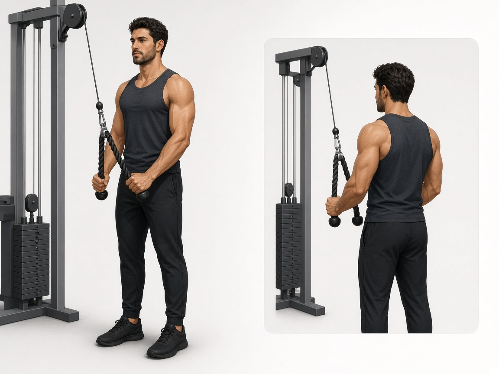

# Разгибания на трицепс на блоке

**Группа:** трицепс (изоляция)  
**Схема:** A и B  
**Картинка:**

## Как делать
1. Канат или прямая рукоять, локти прижаты к корпусу.
2. Разгибание вниз без раскачки, внизу можно чуть развести канат.
3. Не зависать на суставе в нижней точке с болью в локте.

## Ошибки
- Локти уезжают вперёд/в стороны
- Жим всем корпусом
- Брусья «глубоко» вместо блока при ноющих плечах

## Мой макс / рабочий
| Дата | Рукоять | Рабочий на 10–12 | Заметка |
|------|---------|------------------|---------|
| 28.09.2026 | канат / прямая | 14 | |
