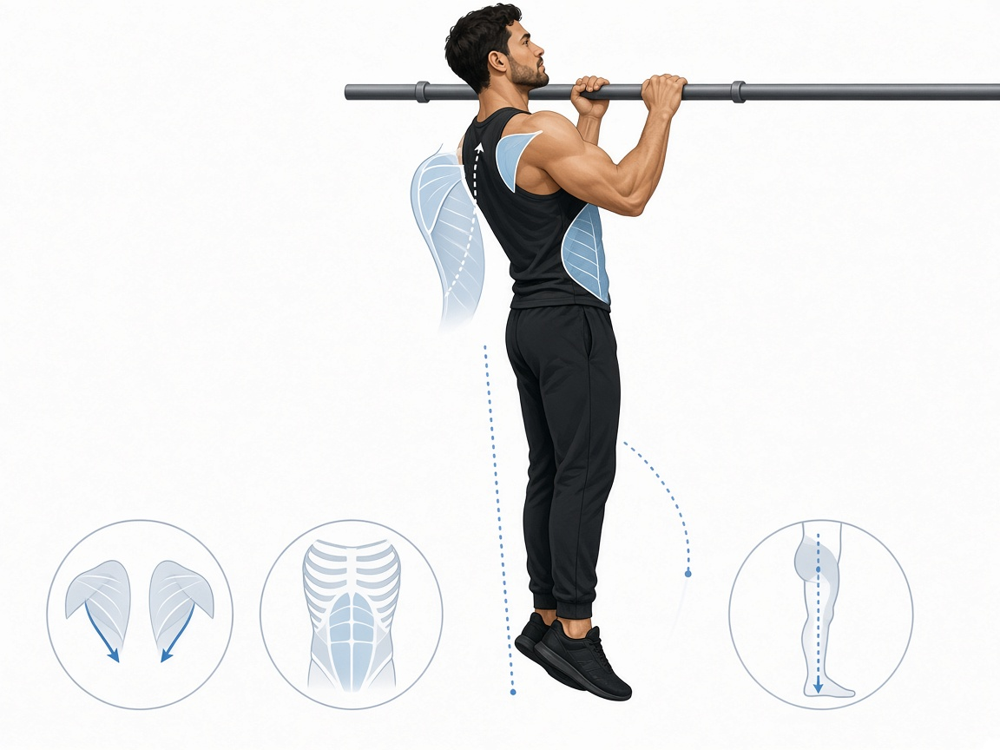

# Подтягивания

**Группа:** спина  
**Схема:** B (иногда)  
**Картинка:**

## Как делать
1. Хват чуть шире плеч, тяга груди к перекладине (или подбородок выше — по силе).
2. Можно гравитрон / резинка / негативы — нормально.
3. Контролируемый спуск 2–3 сек.

## Ошибки
- Рывки и раскачка «кип»
- Полный провал в плечах внизу с болью
- Только руки без спины

## Мой макс / рабочий
| Дата | Вариант (вес тела / резина / помощь) | Повторы | Заметка |
|------|--------------------------------------|---------|---------|
| — | резина / гравитрон | 8–10 | оценка от тяги блока 100; без рывков |
