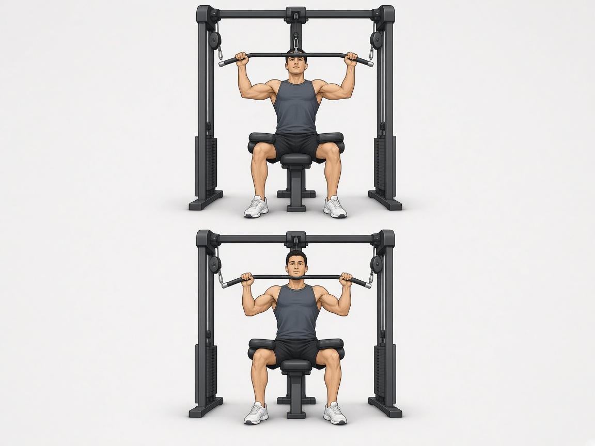

# Тяга верхнего блока к груди

**Группа:** спина  
**Схема:** A  
**Картинка:**

## Как делать
1. Грудь вверх, тянуть **к верхней груди**, не за голову.
2. Локти вниз-вперёд вдоль корпуса.
3. Внизу сведение лопаток, без сильного отклонения корпуса назад.

## Ошибки
- Тяга за голову (убрать навсегда)
- Рывок поясницей
- Хват «только руками» без спины

## Мой макс / рабочий
| Дата | Рабочий на 8–10 | Заметка |
|------|-----------------|---------|
| 28.09.2026 | 100 | |
