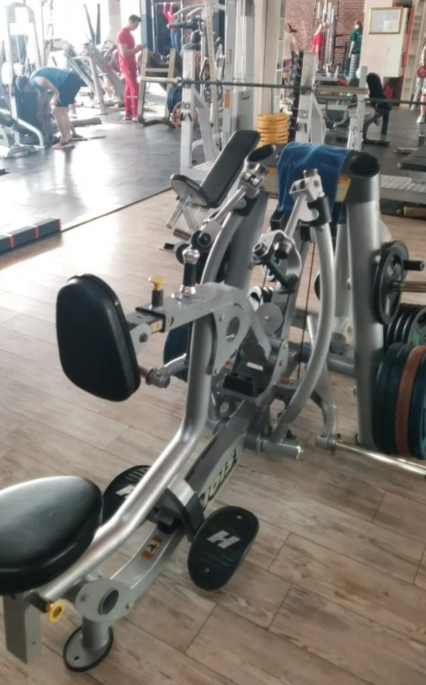

# Тяга в рычаге с упором в грудь

**Группа:** спина  
**Схема:** B  
**Картинка:**

## Как делать
1. Сядь так, чтобы упор был на середину груди; стопы на платформах.
2. Грудь прижата к подушке — поясница не «гуляет».
3. Тяни рукояти к поясу/нижней груди, локти вдоль корпуса, в конце сведи лопатки.
4. Возврат контролируй, без броска рук вперёд.

## Ошибки
- Отрыв груди от упора и читинг корпусом
- Тяга к шее / слишком высоко — больше трапеции
- Полное выпрямление рук с ударом в суставе

## Мой макс / рабочий
| Дата | Рабочий на 8–10 (на сторону / блины) | Заметка |
|------|--------------------------------------|---------|
| — | — | оценка после первой тренировки B |
