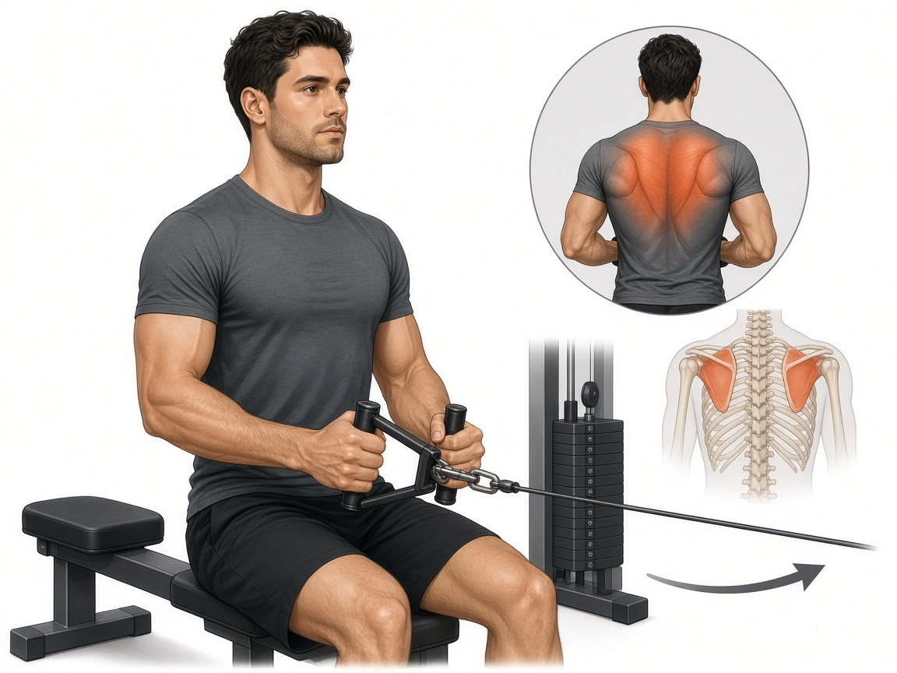

# Тяга сидя к поясу (горизонтальная)

**Группа:** спина  
**Схема:** A / чередование с гантелью  
**Картинка:**

## Как делать
1. Корпус стабильный, без раскачки.
2. Тяга к поясу, в конце сведение лопаток.
3. Не округлять поясницу вперёд на старте.

## Ошибки
- Читинг корпусом
- Рывок поясницей
- Полное «выключение» лопаток

## Мой макс / рабочий
| Дата | Рабочий на 8–10 | Заметка |
|------|-----------------|---------|
| 28.09.2026 | 62 | |
